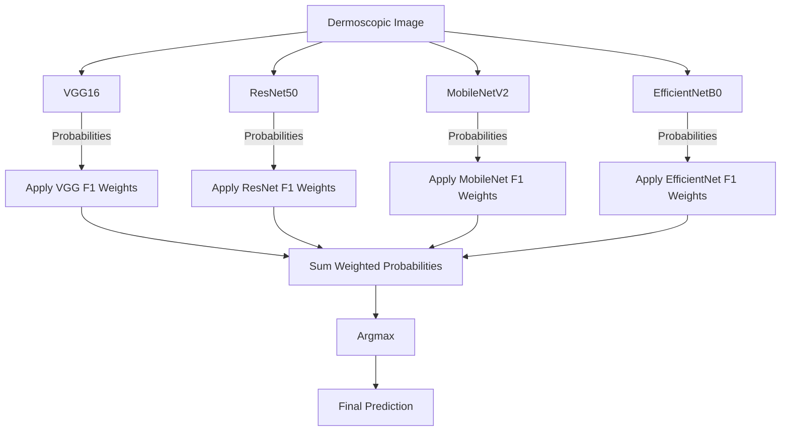
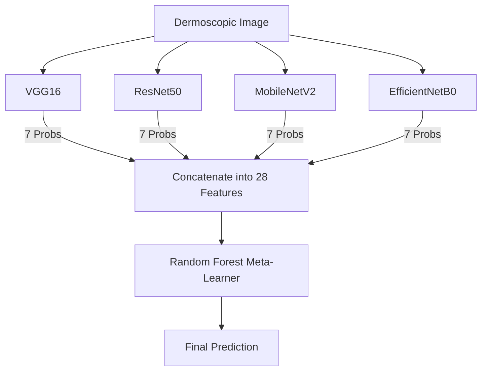
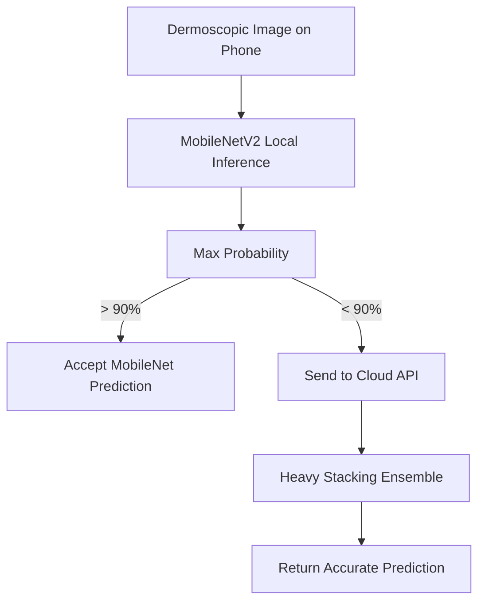
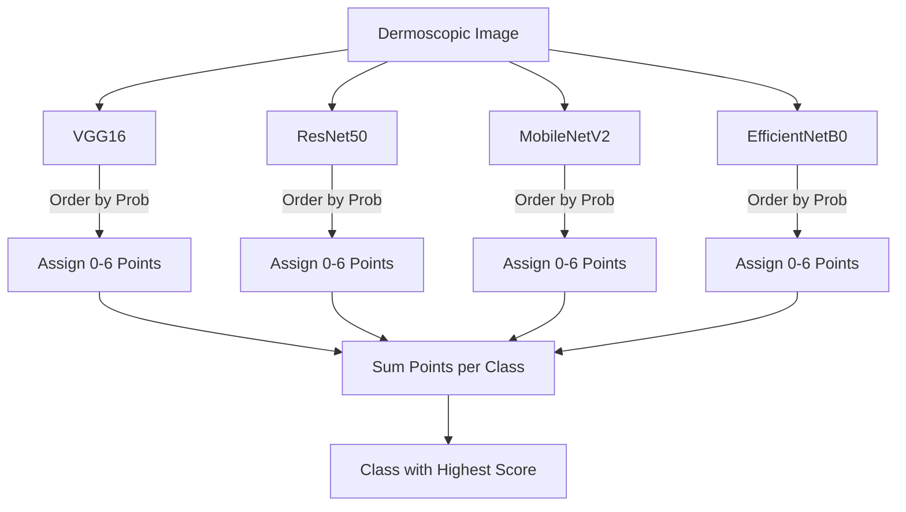
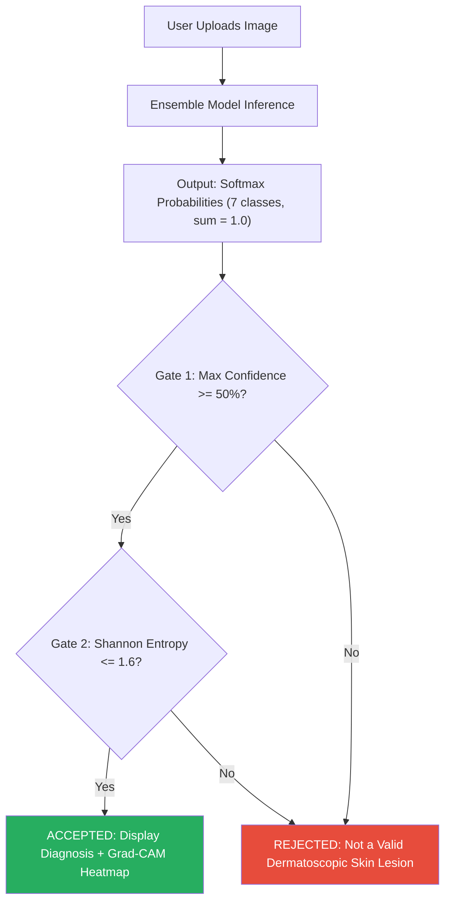

# Model Architectures & Project Structure

This document provides a detailed explanation of the Convolutional Neural Networks (CNNs) used in the X-Skin project, the features they extract, and architectural diagrams of the ensemble techniques developed.

---

## 1. The Base CNN Models

We utilized **Transfer Learning**, loading four distinct, pre-trained CNN architectures from ImageNet and replacing their "classification heads" with custom dense layers tailored to our 7-class dermatoscopic problem.

### VGG16
* **Architecture Style**: Sequential, deep, traditional.
* **Why we used it**: It provides a stable, easy-to-train baseline. It is excellent at picking up basic textures and colors (e.g., the bluish-grey veil in melanoma).
* **Features Extracted**: Low-level features like edges, blobs, and simple geometric shapes in the early layers; complex textures and color blobs in the deeper layers.
* **Drawback**: It is very large (138 million parameters) and computationally heavy.

### ResNet50 (Residual Networks)
* **Architecture Style**: Uses "Skip Connections" (Residual Blocks) to bypass certain layers.
* **Why we used it**: Deep networks suffer from the "vanishing gradient" problem (the signal dies out before reaching the end of the network). Skip connections solve this, allowing the model to be 50 layers deep without losing information.
* **Features Extracted**: Highly complex spatial hierarchies. Excellent at finding specific structural patterns like atypical pigment networks or vascular structures.

### MobileNetV2
* **Architecture Style**: Uses "Depthwise Separable Convolutions" and "Inverted Residuals".
* **Why we used it**: Standard convolutions are computationally expensive. MobileNet splits them into two steps (filtering spatial info, then combining depth info), reducing computation by ~90%. 
* **Features Extracted**: Generalizable, lightweight features. It focuses on the most critical structural outlines rather than granular texture.
* **Advantage**: It is incredibly fast and designed specifically to run on mobile phones with low battery consumption.

### EfficientNetB0
* **Architecture Style**: Uses "Compound Scaling" (balancing network depth, width, and resolution mathematically rather than arbitrarily).
* **Why we used it**: It provides the highest accuracy per parameter. It is a highly optimized, modern architecture that often beats much larger models.
* **Features Extracted**: Extremely optimized feature maps that capture complex, nuanced variations (e.g., distinguishing between a seborrheic keratosis and an early melanoma).

---

## 2. Ensemble Architecture Diagrams

The project developed four distinct ensemble architectures to combine the predictions of the base models. 

### 1. Decoupled Weighted Voting (Soft Voting)
Uses the per-class Validation F1-scores as a mathematical multiplier for each model's prediction.

### 2. Stacking Ensemble (Meta-Learner)
Uses a Machine Learning algorithm (Random Forest) to learn non-linear rules about when to trust which model.

### 3. Confidence-Gated Cascade (Mobile-Optimized)
A real-world engineering solution to save battery on mobile devices.

### 4. Rank-Based Voting (Borda Count)
Ignores probability percentages entirely to protect against overconfident models.

---

## 3. Out-of-Distribution (OOD) Rejection Gate

### The Problem

The softmax activation function used in the final classification layer always produces a probability distribution that sums to exactly 1.0. This means the model is mathematically forced to assign 100% of its confidence across the seven known skin lesion classes, regardless of the input. If a user uploads a photograph of a landscape, a pet, or any image that is not a dermatoscopic skin lesion, the model will still return a diagnosis with apparent confidence. Without an additional safeguard, there is no mechanism to reject inputs that fall outside the domain the model was trained on.

### The Solution: A Dual-Gate Validation Check

Before displaying any prediction to the user, the system passes the model's output probabilities through a validation function (`is_valid_prediction`) that enforces two independent mathematical checks. Both checks must pass for a prediction to be accepted.

### Gate 1: Confidence Threshold (50%)

The first gate examines the highest predicted probability across all seven classes. If no single class receives at least 50% of the total confidence, the model has failed to identify a dominant candidate, and the input is unlikely to be a recognisable skin lesion. A threshold of 50% was selected because a genuinely confident clinical prediction should concentrate the majority of its probability mass on a single diagnosis.

### Gate 2: Shannon Entropy Check (1.6)

The second gate computes the Shannon Entropy of the probability distribution using the formula:

**H = -sum(p * log(p))** for each class probability p

Entropy measures how "spread out" or uncertain a probability distribution is. A perfectly confident prediction (100% on one class) yields an entropy of 0.0. A completely uniform distribution across all seven classes yields the maximum entropy of log(7) = 1.946. The threshold of 1.6 was chosen to provide a reasonable margin below the theoretical maximum: any distribution with entropy above 1.6 indicates that the model is near-uniformly confused and the input is likely out-of-distribution.

### Rejection Behaviour

When both gates fail, the web application displays a red error banner reading "Image Rejected: Not a Valid Dermatoscopic Skin Lesion" along with guidance instructing the user to upload a properly captured dermatoscopic image. No diagnosis, confidence score, or Grad-CAM heatmap is shown for rejected inputs.
